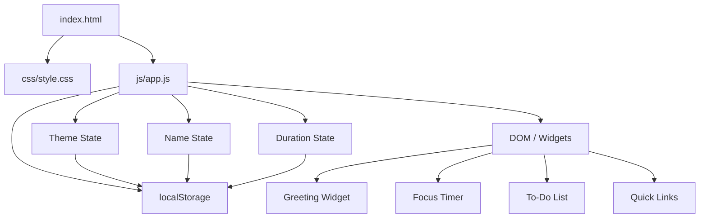

# Design Document — Dashboard Enhancements

## Overview

This document covers three additive enhancements to the existing personal dashboard (vanilla HTML/CSS/JS, no build step, no framework):

1. **Light / Dark mode toggle** — a persistent theme switch applied via a CSS class on `<html>`.
2. **Custom name in greeting** — the greeting widget reads a user-supplied name from Local Storage and appends it to the phrase.
3. **Configurable Pomodoro duration** — the focus timer accepts a user-supplied duration (1–180 min) instead of being hard-coded to 25 minutes.

All three enhancements follow the existing MVC-like pattern: state objects, pure render functions, event handlers, and a thin Storage module. No new files are introduced; changes land in `index.html`, `css/style.css`, and `js/app.js`.

---

## Architecture

The existing architecture is unchanged. Each enhancement slots into the existing layers:



Theme is applied by toggling a `data-theme="dark"` attribute on `<html>`. CSS custom properties keyed on that attribute handle all color changes — no JavaScript touches individual element styles.

---

## Components and Interfaces

### Theme Toggle

A single `<button id="btn-theme-toggle">` placed in a `<header>` above the dashboard grid. It is always visible.

**State:**
```js
// 'light' | 'dark'
let currentTheme = 'light';
```

**Functions:**
```js
applyTheme(theme)   // sets data-theme attr on <html>, updates toggle label
toggleTheme()       // flips currentTheme, calls applyTheme, persists to Storage
```

**DOM interface:**
```
#btn-theme-toggle   — button; textContent reflects active theme ("☀ Light" / "☾ Dark")
```

Theme is loaded from Storage before `DOMContentLoaded` renders anything (inline `<script>` in `<head>`, or first line of the `DOMContentLoaded` handler).

---

### Greeting Widget (name extension)

Extends the existing widget with a small inline form below the existing time/date display.

**State:**
```js
let userName = '';   // trimmed string; '' means no name saved
```

**Functions:**
```js
buildGreeting(hour, name)  // pure: returns e.g. "Good morning, Alex" or "Good morning"
saveName(name)             // trims, persists to Storage, updates userName, re-renders
renderGreeting()           // reads userName + current Date, updates #greeting-text
```

**DOM additions:**
```
#name-input        — text input, placeholder "Your name…"
#btn-save-name     — "Save" button
#name-error        — inline .error-msg (hidden by default, not needed for this widget
                     since empty/whitespace clears rather than errors)
```

`updateGreeting()` (the existing 1-second interval function) is updated to call `buildGreeting` with the current `userName`.

---

### Focus Timer (duration extension)

Extends the existing timer widget with a duration input row below the controls.

**State additions:**
```js
let configuredDuration = 1500;   // seconds; default 25 min
```

`timerReset()` is updated to use `configuredDuration` instead of the hard-coded `1500`.

**Functions:**
```js
validateDuration(value)    // pure: returns {ok: true, minutes: n} or {ok: false, error: string}
setDuration(minutes)       // updates configuredDuration, resets timer, persists to Storage
```

**DOM additions:**
```
#duration-input      — number input (min=1, max=180), placeholder "25"
#btn-set-duration    — "Set" button
#duration-error      — inline .error-msg
```

Both `#duration-input` and `#btn-set-duration` are disabled while `timerState.running === true` (handled in `renderTimer()`).

---

### Storage Module (extended)

Three new key/value pairs added alongside the existing `pd_tasks` / `pd_links` keys:

| Key | Value | Default |
|---|---|---|
| `pd_theme` | `"light"` \| `"dark"` | `"light"` |
| `pd_name` | trimmed string | `""` (absent) |
| `pd_duration` | integer string (minutes) | `"25"` (absent → 25) |

New Storage methods:
```js
Storage.getTheme()           // returns 'light' | 'dark'
Storage.saveTheme(theme)     // persists theme string
Storage.getName()            // returns trimmed string or ''
Storage.saveName(name)       // persists trimmed name; if empty, removes key
Storage.getDuration()        // returns integer minutes (default 25)
Storage.saveDuration(mins)   // persists integer as string
```

---

## Data Models

### Theme

```js
// 'light' | 'dark'
type Theme = string;
```

Applied as `document.documentElement.setAttribute('data-theme', theme)`. CSS custom properties on `:root` and `[data-theme="dark"]` drive all color changes.

### User Name

```js
// non-empty trimmed string, or '' when absent
type UserName = string;
```

### Duration

```js
// integer in [1, 180] representing minutes
// stored in timerState as seconds: configuredDuration = minutes * 60
type DurationMinutes = number;
```

### Extended Timer State

```js
timerState = {
  remaining: number,    // 0 – configuredDuration (seconds)
  running: boolean,
  complete: boolean
}
// configuredDuration: number (seconds, default 1500)
```

### CSS Custom Properties (theme)

```css
:root {
  --bg-page:    #f0f2f5;
  --bg-widget:  #ffffff;
  --text-main:  #1a1a2e;
  --text-muted: #6b7280;
  --border:     #e5e7eb;
}

[data-theme="dark"] {
  --bg-page:    #0f1117;
  --bg-widget:  #1e2130;
  --text-main:  #e8eaf0;
  --text-muted: #9ca3af;
  --border:     #374151;
}
```

All existing color literals in `style.css` are replaced with these variables.

---

## Correctness Properties

*A property is a characteristic or behavior that should hold true across all valid executions of a system — essentially, a formal statement about what the system should do. Properties serve as the bridge between human-readable specifications and machine-verifiable correctness guarantees.*

### Property 1: Theme toggle is a round-trip

*For any* theme value in `{'light', 'dark'}`, calling `toggleTheme` twice SHALL return the theme to its original value.

**Validates: Requirements 1.2**

---

### Property 2: Theme persistence round-trip

*For any* theme value in `{'light', 'dark'}`, calling `Storage.saveTheme(theme)` then `Storage.getTheme()` SHALL return the same value.

**Validates: Requirements 1.5, 1.6**

---

### Property 3: Theme toggle label reflects active theme

*For any* theme value, after calling `applyTheme(theme)`, the toggle button's text content SHALL contain a string that identifies the current theme (e.g. "Dark" when dark is active, "Light" when light is active).

**Validates: Requirements 1.8**

---

### Property 4: Greeting with name matches expected format

*For any* hour in [0, 23] and any non-empty, non-whitespace-only name string, `buildGreeting(hour, name.trim())` SHALL return a string of the form `"[phrase], [trimmedName]"` where `[phrase]` is the correct time-of-day greeting for that hour.

**Validates: Requirements 2.2, 2.7**

---

### Property 5: Whitespace-only name is cleared

*For any* string composed entirely of whitespace characters (including the empty string), calling `saveName(s)` SHALL result in `Storage.getName()` returning `''` and the greeting displaying without a name suffix.

**Validates: Requirements 2.6**

---

### Property 6: Name persistence round-trip

*For any* non-empty, non-whitespace-only name string `s`, calling `Storage.saveName(s.trim())` then `Storage.getName()` SHALL return `s.trim()`.

**Validates: Requirements 2.3, 2.4**

---

### Property 7: Valid duration sets timer to correct seconds

*For any* integer `n` in [1, 180], calling `setDuration(n)` SHALL produce `timerState.remaining === n * 60`, `timerState.running === false`, and `timerState.complete === false`.

**Validates: Requirements 3.2**

---

### Property 8: Reset restores configured duration

*For any* valid duration `n` in [1, 180], after `setDuration(n)` and then `timerReset()`, `timerState.remaining` SHALL equal `n * 60`.

**Validates: Requirements 3.3**

---

### Property 9: Invalid duration is rejected

*For any* value that is not a positive integer in [1, 180] (including floats, zero, negatives, values > 180, and non-numeric strings), `validateDuration(value)` SHALL return a failing result and `timerState.remaining` SHALL be unchanged.

**Validates: Requirements 3.4, 3.5**

---

### Property 10: Duration persistence round-trip

*For any* integer `n` in [1, 180], calling `Storage.saveDuration(n)` then `Storage.getDuration()` SHALL return `n`.

**Validates: Requirements 3.6, 3.7**

---

### Property 11: Duration input disabled while running

*For any* `timerState` with `running === true`, calling `renderTimer()` SHALL set `#duration-input.disabled` and `#btn-set-duration.disabled` to `true`.

**Validates: Requirements 3.9**

---

## Error Handling

| Scenario | Handling |
|---|---|
| No theme in Local Storage | Default to `'light'` |
| No name in Local Storage | Greeting displays without name suffix |
| No duration in Local Storage | Default to 25 minutes (1500 s) |
| Empty / whitespace name submitted | Clear saved name; update greeting; no error shown (clearing is the intended action) |
| Duration not a positive integer | Show inline `#duration-error`; do not mutate state |
| Duration out of range (< 1 or > 180) | Show inline `#duration-error`; do not mutate state |
| Duration submitted while timer running | `#btn-set-duration` is disabled — not reachable via UI |
| localStorage unavailable | Existing try/catch pattern in Storage module covers new keys |

---

## Testing Strategy

### Approach

Dual testing approach, consistent with the existing `personal-dashboard` spec:

- **Unit / example tests** — DOM presence checks, default-value edge cases, specific UI state transitions
- **Property-based tests** — universal properties across generated inputs

Target language: JavaScript. Property-based testing library: **fast-check**.

### PBT Applicability

PBT is appropriate here. The new logic consists of pure functions (`buildGreeting`, `validateDuration`, `setDuration`, Storage round-trips, `toggleTheme`) with clear input/output behavior and input spaces where randomization reveals edge cases (arbitrary name strings, arbitrary duration values, arbitrary theme states).

### Property-Based Tests

Each property test runs a minimum of 100 iterations. Each test is tagged:

```
// Feature: dashboard-enhancements, Property N: <property text>
```

| Property | fast-check arbitraries |
|---|---|
| P1 — Theme toggle round-trip | `fc.constantFrom('light', 'dark')` |
| P2 — Theme persistence round-trip | `fc.constantFrom('light', 'dark')` |
| P3 — Toggle label reflects theme | `fc.constantFrom('light', 'dark')` |
| P4 — Greeting with name format | `fc.integer({min:0, max:23})`, `fc.string({minLength:1}).filter(s => s.trim().length > 0)` |
| P5 — Whitespace name cleared | `fc.stringOf(fc.constantFrom(' ', '\t', '\n'))` |
| P6 — Name persistence round-trip | `fc.string({minLength:1}).filter(s => s.trim().length > 0)` |
| P7 — Valid duration sets seconds | `fc.integer({min:1, max:180})` |
| P8 — Reset restores configured duration | `fc.integer({min:1, max:180})` |
| P9 — Invalid duration rejected | `fc.oneof(fc.integer({max:0}), fc.integer({min:181}), fc.double().filter(n => !Number.isInteger(n)), fc.string().filter(s => isNaN(Number(s))))` |
| P10 — Duration persistence round-trip | `fc.integer({min:1, max:180})` |
| P11 — Duration input disabled while running | `fc.integer({min:0, max:1500})` (remaining), with running=true |

### Unit / Example Tests

- Theme toggle button exists in DOM (Req 1.1)
- Default theme is light when localStorage is empty (Req 1.7)
- Name input exists in greeting widget (Req 2.1)
- Greeting without name shows phrase only (Req 2.5)
- Duration input exists in timer widget (Req 3.1)
- Default duration is 1500 s when localStorage is empty (Req 3.8)

### Test File Structure

```
tests/
  theme.test.js      — Properties 1, 2, 3 + DOM presence + default examples
  greeting.test.js   — Properties 4, 5, 6 + no-name example (extends existing file)
  timer.test.js      — Properties 7, 8, 9, 10, 11 + default duration example (extends existing file)
```
