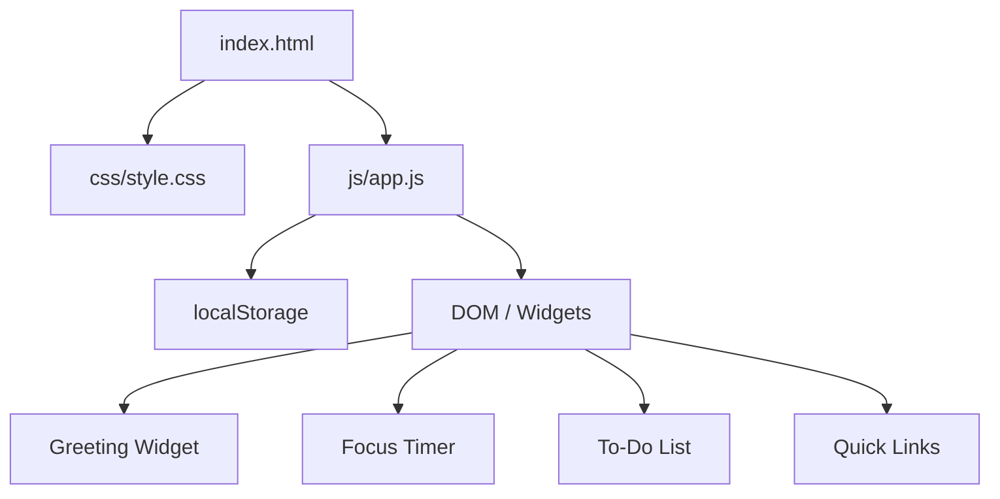

# Design Document

## Overview

The personal dashboard is a self-contained, single-page web application built with HTML, CSS, and vanilla JavaScript. It runs entirely in the browser with no backend or external dependencies. All user data (tasks and quick links) is persisted via the browser's Local Storage API.

The app is composed of four widgets rendered in a responsive grid:
- **Greeting Widget** — live clock, date, and time-of-day greeting
- **Focus Timer** — 25-minute Pomodoro countdown with start/stop/reset
- **To-Do List** — task management with add/edit/complete/delete and Local Storage persistence
- **Quick Links** — saved URL shortcuts that open in new tabs, with Local Storage persistence

---

## Architecture

The application follows a simple MVC-like separation within a single JavaScript file:

- **State** — plain JS objects holding the current timer state, task list, and link list
- **Render functions** — pure functions that read state and update the DOM
- **Event handlers** — functions that mutate state and call render
- **Storage module** — thin wrapper around `localStorage` for serialization/deserialization

There are no build steps, bundlers, or frameworks. The browser loads one HTML file, one CSS file, and one JS file.



---

## Components and Interfaces

### Greeting Widget

Reads `new Date()` on a 1-second interval via `setInterval`. Derives:
- Time string: `HH:MM` (zero-padded hours and minutes)
- Date string: formatted with `Intl.DateTimeFormat` (e.g., "Monday, July 14, 2025")
- Greeting: determined by hour bucket (see Data Models)

No state is persisted for this widget.

**DOM interface:**
```
#greeting-text   — greeting message
#time-display    — HH:MM string
#date-display    — human-readable date
```

### Focus Timer

Manages a countdown from 1500 seconds. Uses a single `setInterval` handle stored in module scope. State is not persisted (resets on page load by design).

**State shape:**
```js
timerState = {
  remaining: 1500,   // seconds
  running: false,
  complete: false
}
```

**DOM interface:**
```
#timer-display   — MM:SS string
#btn-start       — starts countdown (disabled while running)
#btn-stop        — pauses countdown (disabled while stopped)
#btn-reset       — resets to 1500s, stops
.timer-complete  — class applied to widget when complete
```

### To-Do List

Manages an ordered array of task objects. Renders the full list on every state change. Supports inline editing via a toggled input field per task row.

**DOM interface:**
```
#task-input      — new task text input
#btn-add-task    — submit new task
#task-error      — inline validation message
#task-list       — <ul> container for task items
```

Each task item renders as:
```
[checkbox] [label | edit-input] [edit btn] [delete btn]
```

### Quick Links

Manages an ordered array of link objects. Renders the full list on every state change.

**DOM interface:**
```
#link-label-input  — label field
#link-url-input    — URL field
#btn-add-link      — submit new link
#link-error        — inline validation message
#links-list        — container for link buttons
```

Each link renders as a `<button>` (opens URL in new tab) alongside a delete control.

### Storage Module

```js
Storage = {
  getTasks()       // returns Task[] from localStorage, or []
  saveTasks(tasks) // serializes Task[] to localStorage
  getLinks()       // returns Link[] from localStorage, or []
  saveLinks(links) // serializes Link[] to localStorage
}
```

Keys used: `"pd_tasks"`, `"pd_links"`.

---

## Data Models

### Task

```js
{
  id: string,        // crypto.randomUUID() or Date.now().toString()
  label: string,     // non-empty, trimmed
  completed: boolean
}
```

### Link

```js
{
  id: string,        // crypto.randomUUID() or Date.now().toString()
  label: string,     // non-empty, trimmed
  url: string        // must pass URL constructor validation
}
```

### Greeting Hour Buckets

| Hour range  | Message         |
|-------------|-----------------|
| 05:00–11:59 | "Good morning"  |
| 12:00–17:59 | "Good afternoon"|
| 18:00–21:59 | "Good evening"  |
| 22:00–04:59 | "Good night"    |

### Timer State

```js
{
  remaining: number,  // 0–1500 seconds
  running: boolean,
  complete: boolean   // true when remaining === 0 after a countdown
}
```

### URL Validation

A URL is valid if `new URL(value)` does not throw. This accepts `http://`, `https://`, and other schemes. An empty string is always invalid.

---

## Correctness Properties

*A property is a characteristic or behavior that should hold true across all valid executions of a system — essentially, a formal statement about what the system should do. Properties serve as the bridge between human-readable specifications and machine-verifiable correctness guarantees.*


### Property 1: Time formatting is always valid HH:MM

*For any* Date object, the time-formatting function SHALL produce a string matching `HH:MM` where HH is the zero-padded 24-hour hour (00–23) and MM is the zero-padded minute (00–59).

**Validates: Requirements 1.1**

---

### Property 2: Date formatting always contains required components

*For any* Date object, the date-formatting function SHALL produce a string that contains a weekday name, a month name, a day number, and a four-digit year.

**Validates: Requirements 1.2**

---

### Property 3: Greeting matches the correct hour bucket

*For any* hour value in [0, 23], the greeting function SHALL return exactly one of {"Good morning", "Good afternoon", "Good evening", "Good night"} according to the defined hour ranges, and every hour maps to exactly one greeting.

**Validates: Requirements 1.3, 1.4, 1.5, 1.6**

---

### Property 4: Timer tick decrements remaining by one

*For any* running timer state with remaining > 0, applying one tick SHALL produce a state where remaining is exactly one less than before, and complete is false unless remaining was 1 (in which case complete becomes true and running becomes false).

**Validates: Requirements 2.2, 2.5**

---

### Property 5: Timer stop preserves remaining

*For any* timer state with running = true and any remaining value, applying stop SHALL produce a state where running = false and remaining is unchanged.

**Validates: Requirements 2.3**

---

### Property 6: Timer reset always produces the initial state

*For any* timer state (any remaining, any running, any complete), applying reset SHALL produce exactly {remaining: 1500, running: false, complete: false}.

**Validates: Requirements 2.4**

---

### Property 7: Timer display is always valid MM:SS

*For any* integer seconds in [0, 1500], the time-display formatting function SHALL produce a string matching `MM:SS` where MM and SS are zero-padded and the total seconds encoded equals the input.

**Validates: Requirements 2.6**

---

### Property 8: Button states match running flag

*For any* timer state, the derived button-enabled state SHALL satisfy: if running = true then start is disabled and stop is enabled; if running = false then start is enabled and stop is disabled.

**Validates: Requirements 2.7, 2.8**

---

### Property 9: Adding a valid task grows the list

*For any* task list and any non-empty (non-whitespace-only) task label, calling addTask SHALL produce a list whose length is exactly one greater than before, and the new task SHALL have the trimmed label and completed = false.

**Validates: Requirements 3.1**

---

### Property 10: Whitespace-only input is always rejected

*For any* string composed entirely of whitespace characters (including the empty string), calling addTask or editTask with that string SHALL leave the task list unchanged.

**Validates: Requirements 3.2, 3.5**

---

### Property 11: Editing a task updates only its label

*For any* task list, any task in that list, and any non-empty new label, calling editTask SHALL update only that task's label (trimmed) and leave all other tasks and the completed state unchanged.

**Validates: Requirements 3.4**

---

### Property 12: Toggling completion twice restores original state

*For any* task, applying toggleComplete twice SHALL produce a task whose completed value equals the original completed value (round-trip idempotence).

**Validates: Requirements 3.6**

---

### Property 13: Deleting a task removes it from the list

*For any* task list with at least one task, calling deleteTask on any task in the list SHALL produce a list that does not contain a task with that id, and all other tasks remain unchanged.

**Validates: Requirements 3.7**

---

### Property 14: Storage round-trip preserves task and link lists

*For any* array of Task objects, serializing to Local Storage and then deserializing SHALL produce an array that is deeply equal to the original. The same property holds for any array of Link objects.

**Validates: Requirements 3.8, 3.9, 4.5, 4.6**

---

### Property 15: Adding a valid link grows the list

*For any* link list, any non-empty label, and any URL that passes `new URL()` validation, calling addLink SHALL produce a list whose length is exactly one greater than before, and the new link SHALL have the correct label and URL.

**Validates: Requirements 4.1**

---

### Property 16: Invalid link input is always rejected

*For any* input where the label is empty/whitespace-only or the URL fails `new URL()` validation, calling addLink SHALL leave the link list unchanged.

**Validates: Requirements 4.2**

---

### Property 17: Deleting a link removes it from the list

*For any* link list with at least one link, calling deleteLink on any link in the list SHALL produce a list that does not contain a link with that id, and all other links remain unchanged.

**Validates: Requirements 4.4**

---

## Error Handling

| Scenario | Handling |
|---|---|
| Empty / whitespace task input | Show inline `#task-error` message; do not mutate state |
| Empty / whitespace task edit | Show inline validation message; do not save; keep edit mode open |
| Empty link label | Show inline `#link-error` message; do not mutate state |
| Invalid URL | Show inline `#link-error` message; do not mutate state |
| localStorage unavailable (private mode, quota exceeded) | Wrap storage calls in try/catch; log warning to console; app continues without persistence |
| Timer already running on start | Start button is disabled — no double-start possible |
| Timer at zero on tick | Stop interval, set complete=true; no underflow below 0 |

---

## Testing Strategy

### Approach

This feature uses a dual testing approach:

- **Unit / example tests** — verify specific behaviors, UI state transitions, and edge cases
- **Property-based tests** — verify universal properties across randomly generated inputs

The target language is JavaScript. The recommended property-based testing library is **fast-check** (`npm install --save-dev fast-check`).

### PBT Applicability

PBT is appropriate here because the core logic (formatting functions, state transitions, validation, storage serialization) consists of pure functions with clear input/output behavior and large input spaces where randomization reveals edge cases.

### Property-Based Tests

Each property test MUST run a minimum of 100 iterations. Each test MUST be tagged with a comment in the format:

```
// Feature: personal-dashboard, Property N: <property text>
```

| Property | Test description | fast-check arbitraries |
|---|---|---|
| P1 | Time format is HH:MM | `fc.date()` |
| P2 | Date format contains required components | `fc.date()` |
| P3 | Greeting matches hour bucket | `fc.integer({min:0, max:23})` |
| P4 | Tick decrements remaining | `fc.integer({min:1, max:1500})` |
| P5 | Stop preserves remaining | `fc.integer({min:0, max:1500})` |
| P6 | Reset always produces initial state | `fc.record({remaining: fc.integer({min:0,max:1500}), running: fc.boolean(), complete: fc.boolean()})` |
| P7 | MM:SS format is valid | `fc.integer({min:0, max:1500})` |
| P8 | Button states match running flag | `fc.record({running: fc.boolean(), ...})` |
| P9 | Adding valid task grows list | `fc.array(taskArb)`, `fc.string({minLength:1}).filter(s => s.trim().length > 0)` |
| P10 | Whitespace input rejected | `fc.stringOf(fc.constantFrom(' ','\t','\n'))` |
| P11 | Edit updates only label | `fc.array(taskArb, {minLength:1})`, `fc.string({minLength:1}).filter(s => s.trim().length > 0)` |
| P12 | Toggle twice restores state | `fc.record({id: fc.string(), label: fc.string(), completed: fc.boolean()})` |
| P13 | Delete removes task | `fc.array(taskArb, {minLength:1})` |
| P14 | Storage round-trip | `fc.array(taskArb)`, `fc.array(linkArb)` |
| P15 | Adding valid link grows list | `fc.array(linkArb)`, valid label + URL arbitraries |
| P16 | Invalid link input rejected | empty/whitespace labels, malformed URL strings |
| P17 | Delete removes link | `fc.array(linkArb, {minLength:1})` |

### Unit / Example Tests

- Timer initializes to 1500 seconds (Req 2.1)
- Edit control shows input field with current label (Req 3.3)
- Link button calls `window.open` with correct URL and `'_blank'` (Req 4.3)
- CSS media query breakpoint is defined at 768px (Req 5.4, 5.5)
- HTML file contains all four widget containers (Req 5.1)

### Test File Structure

```
tests/
  greeting.test.js   — Properties 1, 2, 3
  timer.test.js      — Properties 4, 5, 6, 7, 8 + timer init example
  todo.test.js       — Properties 9, 10, 11, 12, 13 + edit UI example
  links.test.js      — Properties 15, 16, 17 + window.open example
  storage.test.js    — Property 14
```
